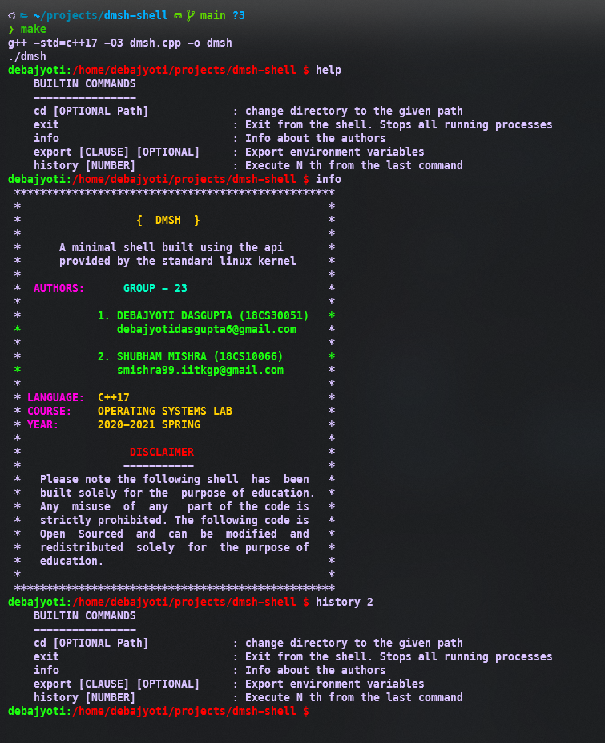
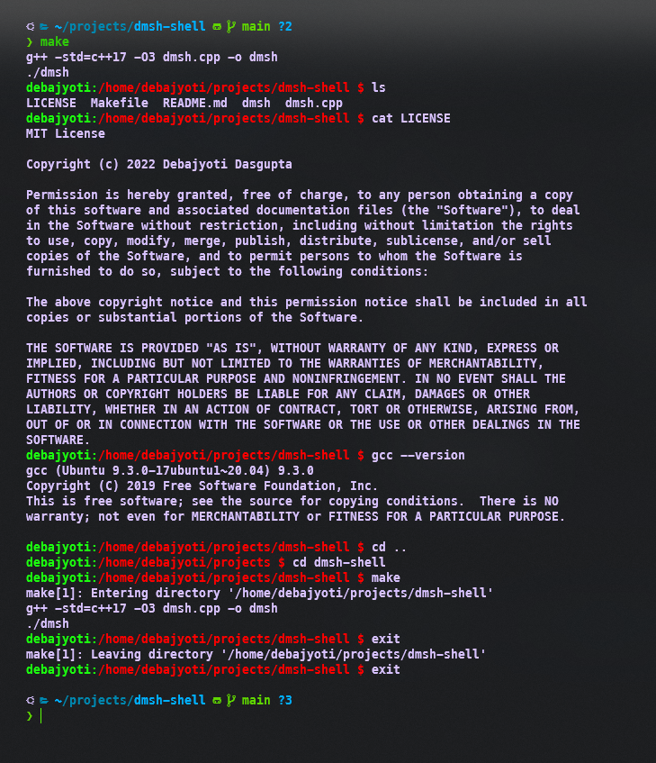

# dmsh-shell

A working prototype of a simple shell built by ***Debajyoti Dasgupta (18CS30051)*** and ***Shubham Mishra (18CS10069)*** as the part of ***Operating Systems Laboratory*** Curriculum ***(CS39002)*** at IIT Kharagpur. 
- The shell is a `simple shell` that can be used to execute commands on the command line. 
- The shell is built on top of the *`POSIX`* shell and is capable of executing most pf the commands that are can be executed in a *`POSIX`* shell. 
- The shell is also capable of executing commands in a `batch file`.
- Facilities like passing commands through `pipes` have also been implemented.

# Running the shell

The following commands are all you need to run the shell.
```shell
$ make
$ ./dmsh
```

# Screenshots

### Help and Introduction


### Executing Commands
] 